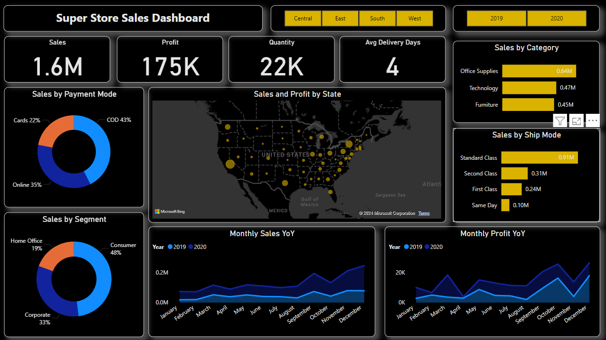

# Superstore Sales Dashboard

## Project Overview

This repository contains a **Sales Dashboard for a Superstore** created in **Power BI**. The dashboard visualizes sales data to provide insights into sales trends, profit margins, regional performance, and customer demographics. It aims to help stakeholders make data-driven decisions to improve sales and operational efficiency.

## Files

- **Superstore Sales Dashboard.pbix**: The Power BI file with all the visualizations and data transformations.
- **SuperStore_Sales_Dataset.csv**: The raw dataset used to build the dashboard.

## Features

- **Sales Analysis**: Total sales, profit, and quantity sold metrics across different categories.
- **Category and Sub-category Performance**: Insights into the best and worst-performing product categories and sub-categories.
- **Regional Analysis**: Visualizations showing performance by region to identify high and low-performing areas.
- **Customer Segmentation**: Customer demographic analysis to target high-value segments.
- **Time-series Trends**: Monthly and yearly trend analysis to observe patterns over time.

## Technologies Used

- **Power BI**: Used for data visualization and dashboard creation.
- **DAX (Data Analysis Expressions)**: For creating calculated columns and measures.
- **Excel**: For initial data exploration and transformation.
- **CSV File**: Data source format used in this analysis.

## Data

The dataset contains sales data from a fictional superstore, with information such as:
- Order ID, Customer ID, Segment, Country, City, State, Postal Code
- Product Category and Sub-Category
- Sales, Quantity, Discount, and Profit

### Sample Data Structure

| Order ID | Customer ID | Segment | Country | Product Category | Sales | Profit |
|----------|-------------|---------|---------|------------------|-------|--------|
| CA-2016-152156 | CG-12520 | Consumer | United States | Furniture | 261.96 | 41.91 |

## Setup

1. **Download the Repository**:
   - Clone this repository using `git clone <repository-url>`.
2. **Open Power BI**:
   - Open `Superstore Sales Dashboard.pbix` in Power BI Desktop.
3. **Load the Dataset**:
   - Ensure the `SuperStore_Sales_Dataset.csv` file is in the same folder as the `.pbix` file to avoid broken links.
4. **Customize**:
   - Modify visualizations, add new insights, or adjust filters as per your needs.

## Usage

1. **Explore Visualizations**:
   - Gain insights from the dashboard's visuals on sales performance, profitability, and customer trends.
2. **Filter Data**:
   - Use Power BI filters to view data by region, segment, or specific product categories.
3. **Identify Opportunities**:
   - Analyze high and low-performing categories and regions to make informed business decisions.

## Dashboard Insights

Some key insights provided by the dashboard include:
- **Top Performing Regions**: Identify regions with the highest sales and profit margins.
- **Category Performance**: Recognize which product categories drive the most revenue and profit.
- **Time-based Trends**: Observe how sales and profit fluctuate over time to forecast future sales.

## License

This project is licensed under the MIT License - see the [LICENSE](LICENSE) file for details.

## Contact

For further questions or feedback, feel free to reach out:

**Altamash Rahman**  
**[LinkedIn](www.linkedin.com/in/altamash-ra)**  
**Email: altamash6044@gmail.com**
